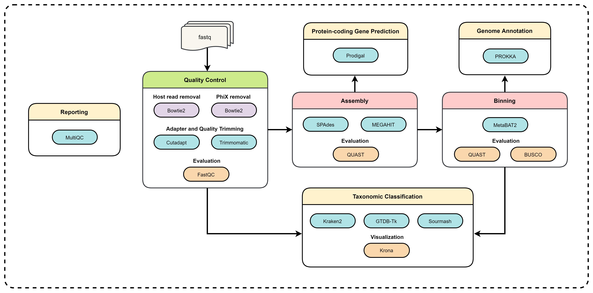

## Introduction

Shotgun metagenomic sequencing involves randomly fragmenting DNA into many small pieces. These fragmented pieces of DNA are then sequenced, and their DNA sequences are stitched back together using bioinformatics tools to identify the species and genes present in the sample. Metagenomics requires several tools for processing and analyzing raw sequencing data. There are already numerous open-source tools available for processing each step. While this is helpful, it can also be difficult to determine which tools to use and how they compare to one another. There are several advantages with open-source resources like flexibility to customize, cost efficiency, collaboration with the community, transparency, and reproducibility.  But the open-source tools have their own set of disadvantages such as lack of maintenance, compatibility issues with in-house applications or environments, open bug issues and security vulnerabilities. Thus, there is a need for a benchmarking pipeline that could help us compare the performance of different metagenomics data processing tools.


**zifornd/metaBP** is a bioinformatics best-practice benchmarking pipeline for QC,assembly, binning and annotation of metagenomes.

The current pipeline is made by using **nf-core/mag** pipeline **version 2.1.1** [nf-core/mag](https://github.com/nf-core/mag/releases/tag/2.1.1) as the base framework to which various tools have been added for benchmarking. 

<p align="center">
    
</p>

The pipeline is built using [Nextflow](https://www.nextflow.io), a workflow tool to run tasks across multiple compute infrastructures in a very portable manner. It uses Docker/Singularity containers making installation trivial and results highly reproducible. The [Nextflow DSL2](https://www.nextflow.io/docs/latest/dsl2.html) implementation of this pipeline uses one container per process which makes it much easier to maintain and update software dependencies. Where possible, these processes have been installed from [nf-core/modules](https://github.com/nf-core/modules). 

On release, automated continuous integration tests run the pipeline on a full-sized dataset on the AWS cloud infrastructure. This ensures that the pipeline runs on AWS, has sensible resource allocation defaults set to run on real-world datasets, and permits the persistent storage of results to benchmark between pipeline releases and other analysis sources.

## Pipeline summary

By default, the pipeline currently performs the following: it supports short reads, quality trims the reads and adapters with [Cutadapt](https://github.com/marcelm/cutadapt/) and [Trimmomatic](https://github.com/usadellab/Trimmomatic), and performs basic QC with [FastQC](https://www.bioinformatics.babraham.ac.uk/projects/fastqc/).
The pipeline then:

- assigns taxonomy to reads using [Kraken2](https://github.com/DerrickWood/kraken2/wiki)
- performs assembly using [MEGAHIT](https://github.com/voutcn/megahit) and [SPAdes](http://cab.spbu.ru/software/spades/), and checks their quality using [Quast](http://quast.sourceforge.net/quast)
- predicts protein-coding genes for the assemblies using [Prodigal](https://github.com/hyattpd/Prodigal)
- performs metagenome binning using [MetaBAT2](https://bitbucket.org/berkeleylab/metabat/src/master/), and checks the quality of the genome bins using [Busco](https://busco.ezlab.org/)
- assigns taxonomy to bins using [GTDB-Tk](https://github.com/Ecogenomics/GTDBTk) and/or [Sourmash](https://github.com/sourmash-bio/sourmash)

Furthermore, the pipeline creates intermediate outputs in the Intermediate_output directory and various reports in the Results directory specified, including a [MultiQC](https://multiqc.info/) report summarizing some of the findings and software versions.

## Quick Start

1. Install [`Nextflow`](https://www.nextflow.io/docs/latest/getstarted.html#installation) (`>=21.10.3`)

2. Install any of [`Docker`](https://docs.docker.com/engine/installation/), [`Singularity`](https://www.sylabs.io/guides/3.0/user-guide/) (you can follow [this tutorial](https://singularity-tutorial.github.io/01-installation/)), [`Podman`](https://podman.io/), [`Shifter`](https://nersc.gitlab.io/development/shifter/how-to-use/) or [`Charliecloud`](https://hpc.github.io/charliecloud/) for full pipeline reproducibility _(you can use [`Conda`](https://conda.io/miniconda.html) both to install Nextflow itself and also to manage software within pipelines. Please only use it within pipelines as a last resort; see [docs](https://nf-co.re/usage/configuration#basic-configuration-profiles))_.

3. Download the pipeline and test it on a minimal dataset with a single command:

   ```console
   nextflow run zifornd/metaBP -profile test,YOURPROFILE --outdir <OUTDIR>
   ```

   Note that some form of configuration will be needed so that Nextflow knows how to fetch the required software. This is usually done in the form of a config profile (`YOURPROFILE` in the example command above). You can chain multiple config profiles in a comma-separated string.

   > - The pipeline comes with config profiles called `docker`, `singularity`, `podman`, `shifter`, `charliecloud` and `conda` which instruct the pipeline to use the named tool for software management. For example, `-profile test,docker`.
   > - Please check [nf-core/configs](https://github.com/nf-core/configs#documentation) to see if a custom config file to run nf-core pipelines already exists for your Institute. If so, you can simply use `-profile <institute>` in your command. This will enable either `docker` or `singularity` and set the appropriate execution settings for your local compute environment.
   > - If you are using `singularity`, please use the [`nf-core download`](https://nf-co.re/tools/#downloading-pipelines-for-offline-use) command to download images first, before running the pipeline. Setting the [`NXF_SINGULARITY_CACHEDIR` or `singularity.cacheDir`](https://www.nextflow.io/docs/latest/singularity.html?#singularity-docker-hub) Nextflow options enables you to store and re-use the images from a central location for future pipeline runs.
   > - If you are using `conda`, it is highly recommended to use the [`NXF_CONDA_CACHEDIR` or `conda.cacheDir`](https://www.nextflow.io/docs/latest/conda.html) settings to store the environments in a central location for future pipeline runs.
4. Start running your own analysis!

   ```console
   nextflow run zifornd/metaBP -profile <docker/singularity/podman/shifter/charliecloud/conda/institute> --input '*_R{1,2}.fastq.gz' --outdir <OUTDIR>
   ```

   or

   ```console
   nextflow run zifornd/metaBP -profile <docker/singularity/podman/shifter/charliecloud/conda/institute> --input samplesheet.csv --outdir <OUTDIR>
   ```

See [usage docs](https://github.com/zifornd/metaBP/blob/dev/docs/usage.md) and [parameter docs](https://github.com/zifornd/metaBP/blob/dev/params.md) for all of the available options when running the pipeline.

## Documentation

The zifornd/metaBP pipeline comes with documentation about the pipeline [usage](https://github.com/zifornd/metaBP/blob/dev/docs/usage.md), [parameters](https://github.com/zifornd/metaBP/blob/dev/params.md) and [output](https://github.com/zifornd/metaBP/blob/dev/docs/output.md). Detailed information about how to specify the input can be found under [input specifications](https://github.com/zifornd/metaBP/blob/dev/docs/usage.md).

### Group-wise co-assembly and co-abundance computation

Each sample has an associated group ID (see [input specifications](https://github.com/zifornd/metaBP/blob/dev/docs/usage.md)). This group information can be used for group-wise co-assembly with `MEGAHIT` or `SPAdes` and/or to compute co-abundances for the binning step with `MetaBAT2`. By default, group-wise co-assembly is disabled, while the computation of group-wise co-abundances is enabled. For more information about how this group information can be used see the documentation for the parameters [`--coassemble_group`](https://github.com/zifornd/metaBP/blob/dev/params.md#assembly-options) and [`--binning_map_mode`](https://github.com/zifornd/metaBP/blob/dev/params.md#binning-options).

When group-wise co-assembly is enabled, `SPAdes` is run on accordingly pooled read files, since `metaSPAdes` does not yet allow the input of multiple samples or libraries. In contrast, `MEGAHIT` is run for each group while supplying lists of the individual readfiles.

## Credits

zifornd/metaBP was originally written by Ragavi Shanmugam([@Ragavi-Shanmugam](https://github.com/ragavishanmugam)), Riya Saju([@Riya-Saju](https://github.com/Riya327)), Asma Ali ([@Asma-Ali](https://github.com/asmaali98)) , Lathika Madhan Mohan ([@Lathika-Madhan-Mohan](https://github.com/lathikaa)), Diya Basu ([@Diya-Basu](https://github.com/diyabasu97)) and  Mohamed Kassam ([@Mohamed-Kassam](https://github.com/mohamedkassamzifo)) from [Zifo RnD Solutions](https://www.zifornd.com/).

The current pipeline is made using the [nf-core/mag](https://github.com/nf-core/mag) as the base framework to which various tools have been added for benchmarking. 


## Citations

This pipeline uses code and infrastructure developed and maintained by the [nf-core](https://nf-co.re) community, reused here under the [MIT license](https://github.com/nf-core/tools/blob/master/LICENSE).

> The nf-core framework for community-curated bioinformatics pipelines.
>
> Philip Ewels, Alexander Peltzer, Sven Fillinger, Harshil Patel, Johannes Alneberg, Andreas Wilm, Maxime Ulysse Garcia, Paolo Di Tommaso & Sven Nahnsen.
>
> Nat Biotechnol. 2020 Feb 13. doi: 10.1038/s41587-020-0439-x.

In addition, references of tools and data used in this pipeline are as follows:
An extensive list of references for the tools used by the pipeline can be found in the [`CITATIONS.md`](CITATIONS.md) file.
